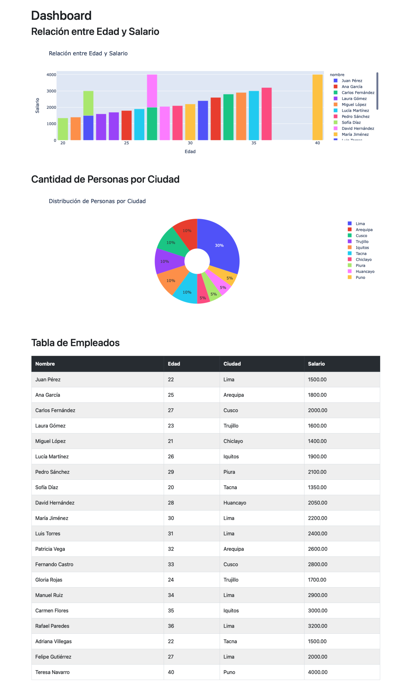

# Dashboard de Empleados con Flask, Mysql o Sqlite Plotly, Bootstrap

Este proyecto es un **dashboard** desarrollado en **Flask** que utiliza **Plotly** para generar 
gráficos interactivos y **Bootstrap** para estilizar una tabla con todos los 
registros de empleados almacenados en la base de datos. 
El objetivo es mostrar la relación entre la **edad y el salario** de los empleados, 
la **distribución de personas por ciudad** y todos los registros en una tabla.

## Características del Proyecto

- Gráfico de barras que muestra la **relación entre la edad y el salario** de los empleados.
- Gráfico circular (Pie Chart) que muestra la **cantidad de personas por ciudad**.
- Tabla con todos los registros de la base de datos, estilizada con **Bootstrap**.
- Backend desarrollado con **Flask**.
- Uso de **SQLAlchemy** para gestionar la base de datos.
- Interfaz limpia y responsive gracias a **Bootstrap**.

## Requisitos

Para ejecutar el proyecto, necesitas tener instalados los siguientes requisitos:

- **Python 3.12.2**
- **Flask 3.0.3**
- **Plotly 5.24.1**
- **Bootstrap 4**

### Instalación de dependencias

Puedes instalar las dependencias necesarias utilizando el archivo `requirements.txt` o instalarlas manualmente:

#### Usando `requirements.txt`

Crea un archivo `requirements.txt` con las dependencias necesarias:

```bash
blinker==1.8.2
click==8.1.7
Flask==3.0.3
Flask-SQLAlchemy==3.1.1
itsdangerous==2.2.0
Jinja2==3.1.4
MarkupSafe==2.1.5
mysql-connector-python==9.0.0
numpy==2.1.1
packaging==24.1
pandas==2.2.3
plotly==5.24.1
python-dateutil==2.9.0.post0
pytz==2024.2
six==1.16.0
SQLAlchemy==2.0.35
tenacity==9.0.0
typing_extensions==4.12.2
tzdata==2024.2
Werkzeug==3.0.4
```

Luego, ejecuta el siguiente comando en la terminal para instalar las dependencias:

```bash
pip install -r requirements.txt
```

### Ejecutar la Aplicación
Para ejecutar el servidor Flask, ejecuta el archivo main.py:

```bash
python main.py
```

## Uso

Una vez ejecutado el servidor Flask, puedes acceder a la aplicación en la dirección `http://localhost:5000/`.

## urls

| Ruta                   | Descripción                                  |
|------------------------|----------------------------------------------|
| `employees/`           | Endpoint muestra todos los empleados en json |
| `employees/dashboard/` | Página de Dashboard                          |


